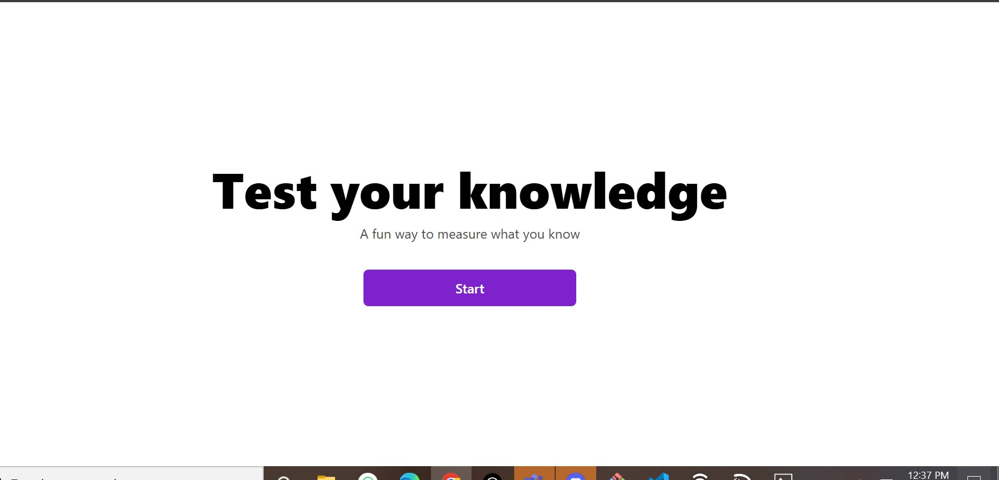
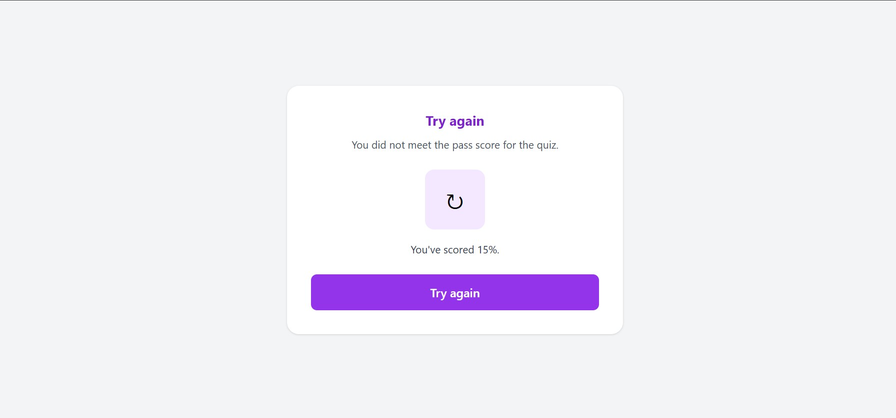

# BrainBurst Quiz Application

An interactive quiz application built with **React (Vite)** and **Tailwind CSS** that fetches **20 random questions** from the Open Trivia Database API and displays results with performance feedback.

## 📸 Screenshots

### Landing Page First page

### Results Page
 